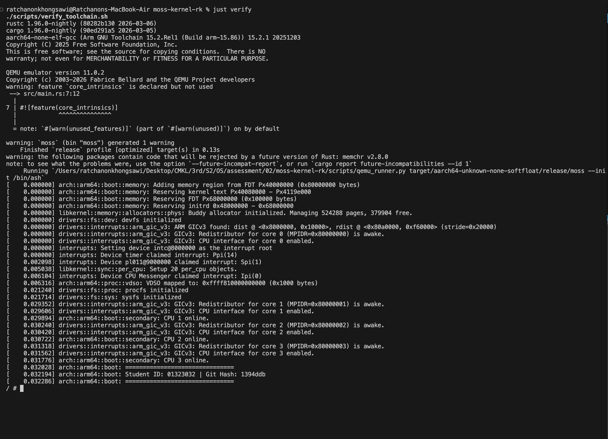
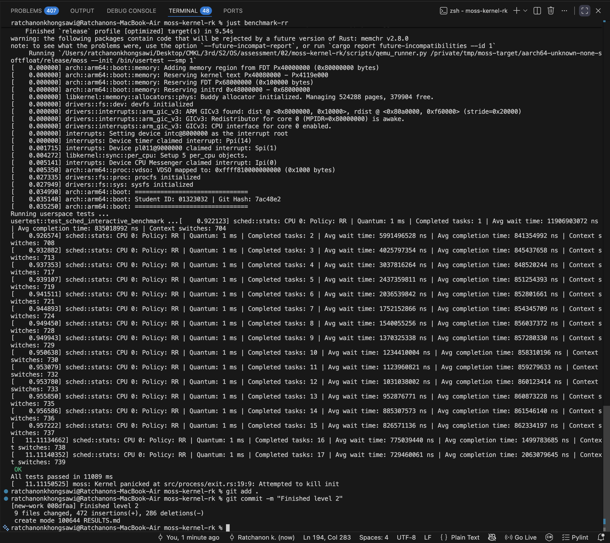
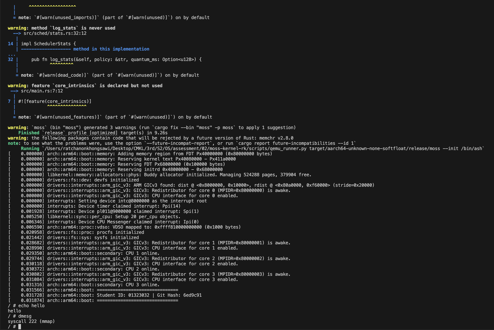
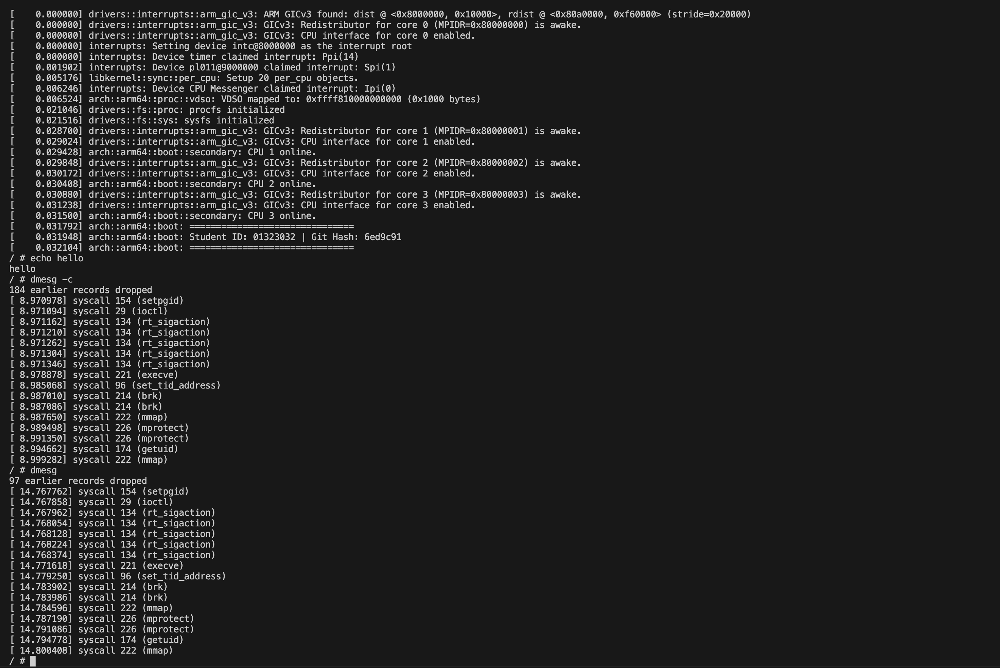

# Assessment

## Run Instructions
`just run`: to build and run with EEVDF policy.
`just run-rr`: to build and run with RR policy.
`just benchmark`: to build and benchmark EEVDF policy.
`just benchmark-rr`: to build and benchmark RR policy.
`just verify`: to verify toolchain and booting.
## Level 1

### Implementation Steps
1. Implement `make_boot_banner()` to prepare boot banner for logging. `moss-kernel-rk/build.rs (line 6 - 16)` 
2. Add logging during boot. `src/arch/arm64/boot/mod.rs (line 146 - 148)`
3. Implement `verify_toolchain.sh` to verify toolchain `scripts/verify_toolchain.sh`
4. Add `Just` blueprint to verify tool chain. `Justfile (line 49 - 50)`

### Boot Output
**See `boot.log`**

### Screenshot


## Level 2

### Schedule Policy Comparison
**See RESULTS.md**

### Implementation Steps
1. Add `ROUND_ROBIN_QUANTUM` to represent each process allocated time slice.  `src/sched/sched_rr.rs (line 29)`
2. Implement `RRTask` class to keep track an RR specific metrics. `src/sched/sched_rr.rs (line 31 - 69)`
3. Implement `RRScheduler` to handel Round Robin policy. `src/sched/sched_rr.rs (line 71 - 218)`
4. Add `#[cfg(feature = "sched-rr")]` to select which policy to build. `src/sched/mod.rs (line 31 - 32, 119 - 130, 169 - 172, 183 - 186)`
5. Add `SchedulerStats` to keep track of each policy statistic. `src/sched/stats.rs`
6. Add tests in `moss-kernel-rk/usertest/src/main.rs (line 198 - 369)`
7. Add `Just` blueprint to run rr and benchmark. `Justfile (line 14 - 36)`

### Screenshot


## Level 3

### Flow
1. The dmesg program places the syscall number in ARM64 register `x8`, i.e. `0x74`,  and its arguments in `x0`–`x2`.
2. Moss’s syscall handler reads these registers and call the matching arm which is `sys_syslog(type, buf, len)`.
3. `sys_syslog` validate type using `match`, if it dose not match any returns `KernelError::InvalidValue`.
    1. **Type 3**: 
          1. Acquire the lock to read from global `LOG`.
          2. Calculate the size to write using `min(len, log.len())`.
          3. Write to user buffer using `copy_to_user_slice`.
          4. Return the written size.
    2. **Type 5**: Acquire the lock and set `LOG` to `None`. 
    3. **Type 10**: Return the global `LOG_BUFFER_SIZE`.
4. `handle_syscall` converts the result into the Linux convention and return it.

### Implementation Steps
1. Add `0x74` arm in `src/arch/arm64/exceptions/syscall.rs (line 437)` to make `handle_syscall` knows how to handle it.
2. Implement `src/kernel/syslog.rs`
    1. `record_syscall(nr)` for recording the syscall.
    2. `sys_syslog(type, buf, len)` to handle each type.
    3. `syscall_name(nr)` for resolving from syscall number to name.
3. Add recording logic at `src/arch/arm64/exceptions/syscall.rs (line 650 - 653)`

### Screenshot


## Level 4

### Decision
For this task, I used the SLAB allocator through the kernel's global allocator. SLAB is suitable for this allocation pattern because the ring buffer is a relatively small, fixed-size allocation, and SLAB is designed to efficiently manage small allocations and reuse freed memory.

A Buddy allocator would be less suitable because it allocates memory in power-of-two-sized blocks. A request may therefore be rounded up to a larger block than necessary, causing internal fragmentation and wasting memory.

A bump allocator would also be unsuitable for a long-lived logging system because it only moves its allocation pointer forward and generally cannot reclaim individual allocations. Repeated allocation would therefore consume memory without reusing previously allocated space.

### Impletion Steps
1. Add `LogRecord` to store each syscall number and timestamp in `src/kernel/syslog.rs (line 22 - 28)`.
2. Add Add a dynamically allocated `RingBuffer` to store the log records in `src/kernel/syslog.rs (line 37 - 115)`.
3. Adjust `sys_syslog(...)` to us the new buffer in `src/kernel/syslog.rs(line 117 - 169)`.

### Screenshot


The syscall entries may look similar because running dmesg itself generates additional system calls. Since the buffer only stores 16 records, these new calls quickly overwrite older entries.


# moss


[](https://webchat.oftc.net/?nick=&channels=%23moss)


**moss** is a Unix-like, Linux-compatible kernel written in Rust and AArch64
assembly.

It features an asynchronous kernel core, a modular architecture abstraction
layer, and binary compatibility with Linux userspace applications. Moss is
currently capable of running a dynamically linked Arch Linux AArch64 userspace,
including bash, BusyBox, coreutils, ps, top, and strace.

## Features

### Architecture & Memory
* Full support for AArch64.
* A well-defined HAL allowing for easy porting to other architectures (e.g.,
  x86_64, RISC-V).
* Memory Management:
    * Full MMU enablement and page table management.
    * Copy-on-Write (CoW) pages.
    * Safe copy to/from userspace async functions.
    * Kernel and userspace page fault management.
    * Kernel stack-overflow detection.
    * Shared library mapping and relocation.
    * `/proc/self/maps` support.
    * Buddy allocator for physical addresses and `smalloc` for boot allocations
      and tracking memory reservations.
    * A full slab allocator for kernel object allocations, featureing a per-CPU
      object cache.

### Async Core
One of the defining features of `moss` is its usage of Rust's `async/await`
model within the kernel context:
* All non-trivial system calls are written as `async` functions, sleep-able
  functions are prefixed with `.await`.
* The compiler enforces that spinlocks cannot be held over sleep points,
  eliminating a common class of kernel deadlocks.
* Any future can be wrapped with the `.interruptable()` combinator, allowing
  signals to interrupt the waiting future and appropriate action to be taken.

### Process Management
* Full task management including both UP and SMP scheduling via EEVDF and task
  migration via IPIs.
* Capable of running dynamically linked ELF binaries from Arch Linux.
* Currently implements [105 Linux syscalls](./etc/syscalls_linux_aarch64.md)
* `fork()`, `execve()`, `clone()`, and full process lifecycle management.
* Job control support (process groups, waitpid, background tasks).
* Signal delivery, masking, and propagation (SIGTERM, SIGSTOP, SIGCONT, SIGCHLD,
  etc.).
* ptrace support sufficient to run strace on Arch binaries.

### VFS & Filesystems
* Virtual File System with full async abstractions.
* Drivers:
    * Ramdisk block device implementation.
    * FAT32 filesystem driver (ro).
    * Ext2/3/4 filesystem driver (read support, partial write support).
    * `devfs` driver for kernel character device access.
    * `tmpfs` driver for temporary file storage in RAM (rw).
    * `procfs` driver for process and kernel information exposure.

## `libkernel` & Testing
`moss` is built on top of `libkernel`, a utility library designed to be
architecture-agnostic. This allows logic to be tested on a host machine (e.g.,
x86) before running on bare metal.

* Address Types: Strong typing for `VA` (Virtual), `PA` (Physical), and `UA`
  (User) addresses.
* Containers: `VMA` management, generic page-based ring buffer (`kbuf`), and
  waker sets.
* Sync Primitives: `spinlock`, `mutex`, `condvar`, `per_cpu`.
* Test Suite: A comprehensive suite of 230+ tests ensuring functionality across
  architectures (e.g., validating AArch64 page table parsing logic on an x86
  host).
* Userspace Testing, `usertest`: A dedicated userspace test-suite to validate
  syscall behavior in the kernel at run-time.

## Building and Running

### Prerequisites

You will need QEMU for AArch64 emulation, as well as wget, e2fsprogs, and jq for image creation.
We use `just` as a task runner to simplify common commands,
but you can also run the underlying commands directly if you prefer.

Additionally, you will need a version of
the [aarch64-none-elf](https://developer.arm.com/Tools%20and%20Software/GNU%20Toolchain) toolchain installed.

To install `aarch64-none-elf` on any OS, download the appropriate release of `aarch64-none-elf` onto your computer,
unpack it, then export the `bin` directory to PATH (Can be done via running:
`export PATH="~/Downloads/arm-gnu-toolchain-X.X.relX-x86_64-aarch64-none-elf/bin:$PATH"`, where X is the version number
you downloaded onto your machine, in your terminal).

#### Debian/Ubuntu
```bash
sudo apt install qemu-system-aarch64 wget jq e2fsprogs just
```

#### macOS

```bash
brew install qemu wget jq e2fsprogs just
```

#### Nix/NixOS
```bash
nix develop
```

### Running via QEMU

To build the kernel and launch it in QEMU:

``` bash
just run
```

If you don't have `just` installed, you can run the underlying commands directly:

``` bash
# First time only (to create the image)
./scripts/create-image.sh
# Then, to run the kernel in QEMU
# By default it will launch into bash, which alpine doesn't have, however `ash` and `sh` are both available.
cargo run --release -- /bin/ash
```

The kernel runs off of `moss.img`.
This image is a minimal alpine rootfs with the addition of a custom `usertest` binary in `/bin/usertest`.

### Running the Test Suite
Because `libkernel` is architecturally decoupled, you can run the logic tests on
your host machine:

``` bash
just test-unit
```

To run the userspace test suite in QEMU:

``` bash
just test-userspace
```

or

```bash
cargo run -r -- /bin/usertest
```

If you've made changes to the usertests and want to recreate the image, you can run:

``` bash
just create-image
```

or

```bash
./scripts/create-image.sh
```

### Roadmap & Status

moss is under active development. Current focus areas include:

* Networking Stack: TCP/IP implementation.
* A fully read/write capable filesystem driver.
* Expanding coverage beyond the current 105 calls.
* systemd bringup.

## Non-Goals (for now)

* Binary compatibility beyond AArch64.
* Production hardening.

Moss is an experimental kernel focused on exploring asynchronous design and
Linux ABI compatibility in Rust.

## Contributing

Contributions are welcome! Whether you are interested in writing a driver,
porting to x86, or adding syscalls.

## License
Distributed under the MIT License. See LICENSE for more information.
